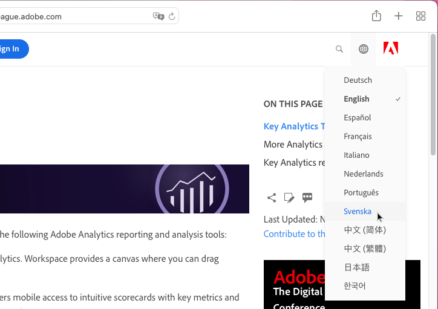
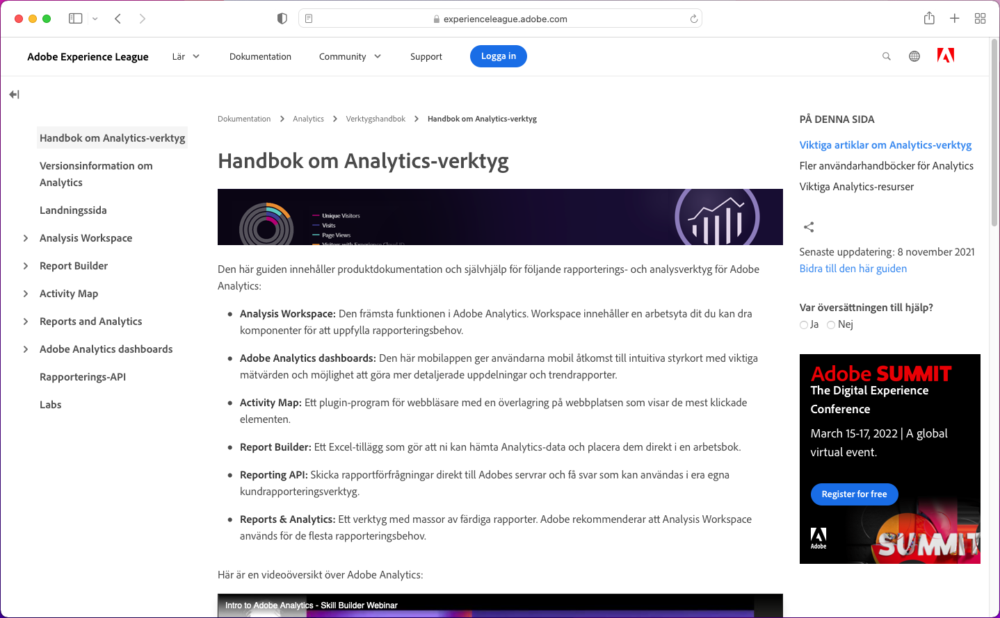
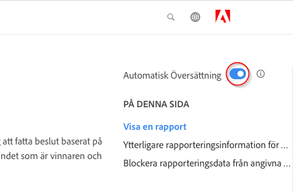
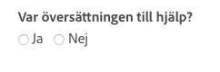

# Språkstöd för Adobe Experience Cloud produktdokumentation

Adobe är införstådd med att man förlitar sig på att produktdokumentation, hjälp och support finns tillgängliga på de språk som Adobe-produkterna har stöd för. För att uppnå detta erbjuder Adobe en unik översättningsupplevelse som gör att du kan välja vilket språk du vill använda och ge feedback på kvaliteten på översatt innehåll.

## Välj ett språk

Du kan läsa Adobe Experience Cloud produktdokumentation på de flesta språk.

1. Navigera till produktdokumentation ](https://helpx.adobe.com/se/support/experience-cloud.html) för Experience Cloud [.

1. Bläddra efter en hjälpsida (till exempel [Analytics](https://docs.adobe.com/content/help/sv-SE/analytics/landing/home.html)).

1. Klicka på språkväljaren (ikon) och välj sedan ett språk.

   

   Sidan visas på det språk du valde.

   

   Om din språkversion ännu inte är tillgänglig kan Adobe automatiskt översätta ditt innehåll. Adobe automatiska översättningstjänst visar ett meddelande längst upp till höger:

   

   Innehållet kan återges automatiskt på ditt språk, eller så kan du klicka på en länk för att utlösa översättningen. (Detta scenario kan inträffa när du har klickat på hyperlänken för att gå tillbaka till den engelska källan från den översatta sidan. Du kan välja att visa den översatta sidan on-demand.) Du kan när som helst gå tillbaka till den engelska källan.

   Ibland kan det engelska källinnehållet ha uppdaterats och publicerats nyligen innan översättningarna var klara. När du klickar på ditt språk i listrutan visas ett meddelande om att sidan automatiskt översattes från den tidigare versionen, med uppdaterat innehåll som ska vara tillgängligt snart, i det ljusblå vågräta fältet överst på sidan. Du kan välja att visa det senaste engelska källinnehållet i ett nytt webbläsarfönster om du vill.

## Varför använda automatisk översättning

Adobe utnyttjar de automatiska översättningsfunktionerna för att publicera produktsupportmaterial på olika språk så nära innehållsskapandet som möjligt. Eftersom supportinnehåll är viktigt för produktanvändningen prioriterar vi översättningen av innehåll av erfarna yrkesmän, men vi kan också välja automatisk översättning där snabbhet och snabbhet är viktigast.

Automatisk översättning är vanligt på Internet och användningen av det är i allmänhet ett kraftfullt verktyg för informationsinsamling. Det har varit en bred användning för innehåll i kunskapsbasen, där det kan finnas ringa eller ingen mänsklig intervention. Även om det har skett stora tekniska genombrott under de senaste åren, kan automatiskt genererade översättningar innehålla enstaka felaktigheter och fel i språk och betydelse.

### Automatisk översättning via webbläsaren

Om du har angett att webbläsarinställningarna ska översätta alla sidor till ditt språk automatiskt, ska du tänka på att de resulterande översättningarna kommer att skilja sig från de som hämtas på Adobe-sidan. Det beror på att den tjänst som webbläsaren erbjuder kan vara stocköversättningar, medan översättningarna i Adobe har anpassats efter riktlinjer och terminologi i Adobe-stil. Om du vill få optimala resultat för automatisk översättning rekommenderar vi att du antingen inaktiverar webbläsaralternativet för den här platsen i webbläsarinställningarna eller klickar på **Översätt aldrig** när den visas.

### Kända fel

Ibland kan det uppstå problem med den automatiska översättningen, t.ex. ofullständiga översättningar, skadade tecken eller sidlayoutproblem. De orsakas av något av de olika verktygen för redigerings-, publicerings- eller översättningsteknik som Adobe använder. Vi ska göra vårt yttersta för att lista de kända problemen här
nedan.

| **UTGÅVA-ID** | **BESKRIVNING** | **STATUS** |
|--------------|-------------------------------------------------------------------------------------|------------|
| G11N3558 | Vissa Audience Manager sidor är halvengelska och halvöversatta (franska, spanska). | ÖPPNA |

### Feedback

När innehåll översätts automatiskt, antingen som standard eller som en användaråtgärd, finns det ett alternativ för att ge Adobe feedback om översättningarna. I
ljusblått vågrätt fält högst upp på sidan kan du svara &quot;Ja&quot; eller &quot;Nej&quot; på frågan &quot;Var denna översättning användbar?&quot;. Adobe samlar in detta värdefulla
mätvärden och analyserar kompilerade data för att kunna fatta beslut om innehållsöversättning. Vi värdesätter din feedback och uppmuntrar dig att svara.

I framtiden planerar vi att ge dig mer utförlig feedback, i form av loggning av ett problem, förslag till förbättringar och även att begära
ytterligare språk. Vissa av dessa funktioner finns redan på de engelska sidorna. På lång sikt tror vi att detta kommer att hjälpa Adobe att förbättra
på dessa sidor.

<!--

-->

### Ansvarsfriskrivning för översättning

Adobe använder ett maskinöversättningsprogram för att översätta text till ett antal olika språk. Observera att datoriserade översättningar är litterala översättningar och kan innehålla fel. Adobe garanterar inte att översättningarna är korrekta, tillförlitliga eller vältajmade. Adobe ansvarar inte för eventuella förluster eller skador som uppstår på grund av att översatta uppgifter är korrekta eller tillförlitliga. Om det finns skillnader mellan engelska och andra språk styr den engelska versionen.

Om du vill rapportera ett översättningsfel eller en felaktighet ber vi dig kontakta oss.
