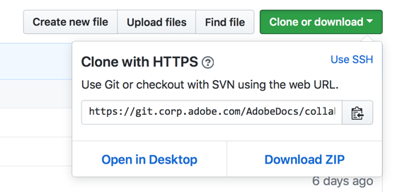

# Konfigurera Git-databasen lokalt för dokumentation

I den här artikeln beskrivs stegen för hur du konfigurerar en Git-databas på den lokala datorn, med avsikten att bidra till Adobe-dokumentationen. Medarbetare kan använda en lokalt klonad databas för att lägga till nya artiklar, göra större redigeringar av befintliga artiklar eller ändra teckningar.

> [!IMPORTANT]
> Om du bara gör mindre ändringar i en artikel behöver du *inte* slutföra stegen i den här artikeln. Du kan bara klicka på ikonen Redigera och göra textredigeringar i webbläsaren.

## Översikt

Om du vill bidra till Adobe-dokumentationen kan du förpacka rätt databas till ditt eget GitHub-konto så att du har läs- och skrivbehörighet. Sedan kan du skapa och redigera markeringsfiler lokalt genom att klona motsvarande dokumentationsdatabas. Sedan använder du pull-begäranden för att sammanfoga (skicka) ändringar i den skrivskyddade centrala delade databasen.

* Bestäm lämplig databas
* Formge databasen till ditt GitHub-konto
* Välj en lokal mapp för de klonade filerna
* Klona databasen till din lokala dator
* Konfigurera det överordnade fjärrvärdet

## Bestämma databasen

Du förser lämplig databas med ditt eget GitHub-konto så att du har läs- och skrivbehörighet där för att lagra dina föreslagna ändringar. [!UICONTROL Adobe Experience Cloud] dokumentation finns i flera olika databaser på [github.com](https://www.github.com/adobedocs).

1. Om du är osäker på vilken databas du ska använda kan du gå till artikeln via webbläsaren. Välj länken **Redigera** (pennikonen) i artikelns övre högra hörn. (Om du inte ser någon Redigera-länk är innehållet ännu inte tillgängligt i GitHub.)

Om du vill bidra till Adobe-dokumentationen kan du skapa och redigera markeringsfiler lokalt genom att klona motsvarande dokumentationsdatabas. Sedan använder du pull-begäranden för att sammanfoga ändringar i den skrivskyddade centrala delade databasen.

<!---

If you're new to GitHub, watch the following video for a conceptual overview of the forking and cloning process:

>[!VIDEO https://channel9.msdn.com/Blogs/CoolMoose/Git-Repository-Setup/player]
-->

## Formge databasen

Använd rätt databas för att skapa en bas av databasen till ditt eget GitHub-konto med hjälp av GitHub-webbplatsen.

Det krävs en personlig gaffel eftersom alla huvuddokumentationsdatabaser ger skrivskyddad åtkomst, vilket innebär att du inte kan göra ändringar direkt i innehållet i databaserna. Om du vill göra ändringar måste du skicka en pull-begäran (PR) från din gaffel till huvuddatabasen. För att underlätta den här processen behöver du först en egen kopia av databasen där du har skrivbehörighet. En GitHub- *gaffel* har det syftet.

1. Gå till huvuddatabasens GitHub-sida och klicka på knappen **Grupp** i det övre högra hörnet.

   

1. Om du får en fråga väljer du din GitHub-kontopanel som mål där gaffeln ska skapas. Den här uppmaningen skapar en kopia av databasen i ditt GitHub-konto, en s.k. gaffel.

1. Välj ett mappnamn som ska vara enkelt att komma ihåg och skriva.

   Vissa databaser kan vara stora. Välj en plats med tillgängligt diskutrymme.

   >[!NOTE]
   >
   >Undvik att välja en lokal mappsökväg som är kapslad i en annan Git-databasmapp. Även om det går att lagra de git-klonade mapparna intill varandra orsakar kapslade Git-mappar i varandra fel för filspårningen.

## Skapa en lokal klon av databasen

Genom att skapa en klon av den förankrade databasen hämtar du en kopia av filerna till datorn. När du är klar kan du överföra redigeringar från din lokala enhet till den förankrade databasen på servern. Sedan kan du skicka en pull-begäran för att sammanfoga redigeringarna uppströms i huvuddatabasen.

I de här stegen antas du använda GitHub Desktop. Om du använder en annan klient gör du lämpliga justeringar.

1. Klicka på **Klona eller hämta** och välj sedan **Öppna på skrivbordet** för att hämta en kopia av databasen (din förgrening) till datorn i den aktuella katalogen.

  

1. Använd GitHub Desktop för att synkronisera de lokala filerna med den kopplade databasen.

Mer information finns i [dokumentationen](https://help.github.com/desktop/)för GitHub-skrivbordet.
