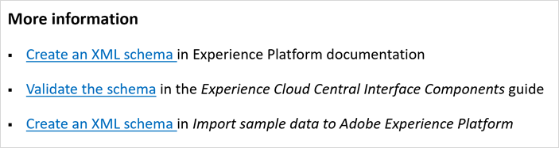

# Riktlinjer för redigeringsformat för externa medarbetare{#guidelines}

Den här sidan innehåller redaktionella riktlinjer för externa författare som skapar innehåll eller uppdaterar befintligt innehåll på Experience League. Innan du börjar ser du till att du:

* Bekanta dig med redigeringen av [Markdown](markdown.md)
* Kontrollera stavning och grammatik i artiklar
* Använd en användarvänlig ton, enhetlig presentation och enkla meningar för att förbättra maskinöversättning
* Följ [bästa praxis](#writing-tips) och redaktionella standarder på den här sidan

## Riktlinjer för format{#style-guidelines}

Tänk på följande när du skriver dokumentation.

* **Skriv kortfattat**: Slösa inte bort ord. Håll meningarna korta och koncisa. Fokusera på artikeln. Minsta antal anteckningar.
* **Fokusera på målgrupp och syfte**: Innan du börjar skriva ska du tydligt avgöra vem kunden är och vilken uppgift han eller hon försöker utföra. Skriv en artikel som hjälper kunden att utföra den uppgiften.
* **Använd exempel**: Ge exempel för att förklara koncept.
* **Organisera ditt innehåll**: Skapa avsnitt för att dela upp instruktioner i mer hanterbara grupper med steg. Använd en skärmbild när den ger klarhet.

## Bästa metoder för tekniskt skrivande{#writing-tips}

Tekniskt skrivande, särskilt för programvarudokumentation, är en specialiserad bransch. Även den mest produktiva romantiken förenklas när du försöker skriva på ett tekniskt sätt - inte för att materialet är komplext eller tekniskt, utan för att det inte är lätt att göra komplex, teknisk information _enkel_. För att lyckas måste innehållet vara strukturellt konsekvent, skannerbart, återanvändbart och flöda genom publiceringsflödet utan struktur- och syntaxfel.

I följande avsnitt beskrivs vanliga problem som nya skribenter måste bevaka:

### Rubriker som inte åtskiljs med text (dubbla rubriker){#double-headings}

Om du har två rubriker utan text som skiljer dem åt, lägger du till text som saknas (för att infoga den andra ämnesrubriken). Du kan också ta bort en av rubrikerna. Den andra är antagligen onödig.

_Översikt_ har till exempel ingen funktion här:

* Om den andra rubriken råkar vara _Översikt_ är den förmodligen inte längre nödvändig. Ditt H1-stycke och det första stycket fungerar som en konceptuell översikt över artikelns ämne.

* På samma sätt är fristående rubriker som _Översikt_ och _Introduktion_ inte användbara själva för SEO-syften. Namnge den produkt eller funktion som du presenterar. (Exempel: _Översikt över bortfallsrapporter_)

### Inkonsekventa korsreferensrubriker{#maps}

Använd _Mer information_ för korsreferenslistor (eller kartor). Exempel:

**Vägledning för korsreferenslistor**

* Använda en punktlista för korsreferenserna
* Använd kursiv stil för det formella namnet på stödlinjer eller sidnamn (när länktext inte används)
* Skiljer inte rubriken (eller någon rubrik)
* Undvik siffror i rubriker

### Innehållsförteckningspost, vägbeskrivning och sidnamn matchar inte{#toc}

Eftersom vi hanterar innehållsförteckningsfilen manuellt är dessa avvikelser enkla misstag. Kontrollera att innehållsförteckningsposten matchar sidnamnet (H1). Se även till att den överensstämmer med den synliga sökvägen.

**Vägledning om innehållsförteckningar och listor**

* Du kan behöva korta ned innehållsförteckningsposten, men den måste tydligt relatera till sidnamnet och sidbeskrivningen.
* Brödkrummar hämtas in från rubrikens metadata, så att de kan skilja sig åt (för SEO-syften).

### Citattecken i stället för kursiv{#quotes}

Det är svårt att motstå att lägga till citattecken runt ett ord eller en fras. Citattecknen är dock avsedda att citera tal och används nästan aldrig i produktdokumentationen.

**Vägledning om citattecken**

* Vanligtvis fungerar kursiv stil bättre än citattecken (för felmeddelanden, unika eller främmande ord osv.).
* Använd fet och UICONTROL för gränssnittselement.

### Rutiner{#steps}

Att skriva en procedur (innehållstypen _aktivitet_) är inte en talang som vi är födda med. Att skapa en läsbar, tydlig procedur är en övning.

**Vägledning för steg**

* En procedur är en serie steg. Ett steg är ett kort, numrerat, _enkelt_-kommando.
* Starta varje steg med ett verb eller _To_-infinitivt (för att rikta läsaren till målet, som i _Aktivera **Fortsätt vara inloggad**&#x200B;_om du vill vara inloggad). Om ett steg har ett specifikt mål inom den övergripande proceduren anger du målet före åtgärden.
* Om du har information om steget (en innehållstyp som heter _steginformation_) lägger du till det efter steget (indraget med steget) eller efter resursen (en skärmbild, video eller en lista med gränssnittsbeskrivningar).
* Om ditt steg har två åtgärder (till exempel _Markera det här och sedan_) skriver du den som en enda kort mening.
* Begränsa dina arbetsmoment till cirka sju till tio steg. Om du skapar mer än tio steg i en uppgift behöver du troligen dela upp den i två uppgifter. Använd din bästa bedömning här.
* Använd inte rubriker som steg i produktdokumentationen. (Undantag nedan för självstudiekurser.)
* För flersidiga självstudiekurser kan du tillåta rubriker som steg. Numrera dem dock inte. Rätta till det här: _Steg 1:_, _Steg 2:_ osv.

**Exempelprocedur**

Här följer en välstrukturerad procedur för inloggning på Adobe:

Så här loggar du in på Adobe:

1. På `Adobe.com` väljer du **Experience Cloud**.
1. Välj **Logga in**.
1. Välj **Personligt konto**.
1. Om du vill fortsätta vara inloggad väljer du **Fortsätt vara inloggad**.
1. Skriv ditt namn och lösenord.
1. Välj **Logga in**.

### Parallella listor{#lists}

Att använda parallell konstruktion för listor gör det enkelt att läsa och skanna. Listor innehåller en innehållsförteckning (innehållsförteckning), punktlistor (osorterade) eller numrerade listor.

Exempel på innehållsförteckning med parallella poster:

Ovanstående innehållsförteckning är ett bra exempel eftersom:

* Konceptuella överordnade poster är substantiv eller substantivfraser
* Rutiner (uppgifter) är aktiva verb (inte GRUND)
* Alla poster använder inledande versal i mening

## Metadata för titel och beskrivning{#metadata}

Metadata för _Rubrik_ och _description_ är viktiga för SEO, innehållsidentifiering och innehållskvalitetspoäng på Experience League.

Här är några exempel på titlar och beskrivningar:

**Beskrivningar för konceptartiklar**

* _Läs om segment i Adobe Analytics. Få hjälp med att konfigurera segmenteringspanelen i en arbetsyta._
* _Hitta hjälp om hur du använder segment i en sidvisningsrapport i Adobe Analytics._

**Beskrivningar för procedur-/uppgiftsartiklar**

* _Lär dig hur du skapar ett segment i Adobe Analytics._
* _Skapa ett segment i Adobe Analytics. Lär dig hur du väljer, konfigurerar och kör en rapport baserat på det segment du skapar._

Vilken du använder beror på artikelns storlek och omfattning.

**Titel för en konceptartikel**

* _Segment i sidvyrapporter_

**Titel för en procedur/uppgiftsartikel**

* _Skapa ett segment för en sidvisningsrapport_

(Kom ihåg att pipe och product name läggs till automatiskt i titlar.)

## Olika sätt att förbättra klarheten (och Acrolinx-poäng){#tips}

Här finns enkla sätt att förbättra innehållsdesign, klarhet och läsbarhet. Dessa hjälper också till att förbättra Acrolinx-stilpoängen och CQI-poängen på ExL.

| Vägledning | Om |
|---|---|
| Använd aktiv röst | Ändra passiv röst till aktiv röst |
| Använd aktuell spänning | **Svag:** *Kampanj v8 släpps i juni.* 
**Stark:** *Campaign v8-utgåvor i juni.*
Det är alltid lättare att läsa dagens spänningar för kunderna. |
| Undvik svaga, kanylfria annonser | *Mycket*, *extremt*, *otroligt*... 
Adverbs är extra ord som inte ger någon större betydelse om du använder tydliga och exakta verb, klausuler och adjektiv. |
| Använd starka verb för titlar och [innehållsförteckningsposter](#using-toc) | Exempel:
**Svag:** *Skapa och hantera egenskaper* 
**Stark:** *Skapa och hantera egenskaper* |
| Använd mening [inledande versal](https://docs.microsoft.com/en-us/style-guide/capitalization) | Använd inte versaler när du är osäker. Använd inledande versal i mening i rubriker. Använd inledande versal i ord och det första ordet efter kolon. I procedurer ska du matcha versaler som visas i gränssnittet. |
| Lär dig dessa små tips för tydlighet | <ul><li>Undvik *För att kunna* (ingen betydelse läggs till). Allt du behöver är *att.*</li><li>Undvik *användning.* Det kan låta mer tekniskt, men det är det inte. *Använd* innebär *att du ska kunna använda, särskilt om något som inte var avsett för ändamålet men som ska användas* är bra.</li><li>Undvik semikolon: Använd en punkt i stället och börja en ny mening. Halvkolon gör det onödigt komplext.</li><li>Kolon: Använd kolon för att infoga en lista. Använd kolon sparsamt i meningar. Inled det första ordet med versal efter ett kolon i en mening.</li><li>Använd kommatecknet Oxford (tre kommatecken i en lista).</li><li>Håll meningens längd under 39 ord.</li><li>Navigering: använd _gå till_ eller _navigera till_.</li><li>Undvik rå URL-text (använd användarvänlig länktext) såvida inte sökvägen visas som viktig information.</li></ul> |
| Använda stavningskontroll i VSC | Installera kodstavningskontroll (tillägg) i Visual Studio-kod. |
| Ändra _klicka_ till _gå till_ eller _välj_ | _Klicka_ är ett enhetsspecifikt ord (med tillgänglighetsproblem) och trenden är att gå bort från det. Här är förslag på hur du kan ändra den:<ul><li>Navigering: _Gå till Arkiv > Skriv ut_.</li><li>Klicka: _Välj Arkiv > Skriv ut_ eller _Välj OK_. </li></ul>Se [Beskriva interaktioner med användargränssnittet](https://docs.microsoft.com/en-us/style-guide/procedures-instructions/describing-interactions-with-ui) om du vill ha mer information om det bästa ordvalet i olika situationer. |
| Kör Acrolinx i VSC | Acrolinx söker efter stilproblem och grammatikproblem. Den kontrollerar URL:er, terminologi, stavning med mera. Det hjälper dig att förbättra klarheten och förbättra översättningen av Experience League innehåll. |

{style="table-layout:auto"}

Några fler metodtips och resurser:

* [Skannerbart innehåll](https://docs.microsoft.com/en-us/style-guide/scannable-content/): Hjälp läsarna att snabbt hitta det de behöver, eller identifiera precis lika snabbt när de inte är där de behöver vara. Att skriva för att underlätta skanningen kan vara till hjälp.
* **Nummer:** I brödtexten kan du stava ut hela tal från noll till nio och använda siffror för 10 eller högre. Se [Nummer](https://docs.microsoft.com/en-us/style-guide/numbers).
* Skriv som du talar, är projektvänlig och kom till saken snabbt.

Mer information finns i [De 10 viktigaste skrivtipsen](https://docs.microsoft.com/en-us/style-guide/top-10-tips-style-voice) i [Microsoft®-formatguiden](https://docs.microsoft.com/en-us/style-guide/welcome/).

## Alt-text{#alt-text}

Lägg till meningsfull alt-text till dina resurser (bilder). Överväg alternativ text som matchar:

* Det mål som kunderna kan uppnå (uppgifts- eller konceptnamn)
* Funktionen eller sidan som du visar
* Ikonnamnet som du visar

Google ser alt-text i SEO-resultat.

## Lokalisering - DNL och UICONTROL{#localization}

Du behöver inte bekymra dig om din produkt är lokaliserad eller om de språk som ExL använder. Du kan dock förbättra kvaliteten på lokaliseringen genom att använda följande två (obligatoriska) taggar:

* `DNL`

  DNL betyder att _inte lokaliserar_. Du använder det bara för varumärken som tillhör Adobe och alla måste vara på engelska.

  Exempel på syntax: `[!DNL Adobe Campaign]` eller `[!DNL Workfront]`

  DNL är inte avsett för filnamn eller URL-adresser.

* `UICONTROL`

  UICONTROL indikerar en gränssnittskontroll (t.ex. ett alternativ, fält, flik, sida, alternativgrupp eller funktionsnamn i användargränssnittet).

  Exempel på syntax: `Select **[!UICONTROL Project]**, then select **[!UICONTROL Save]**.`

>[!IMPORTANT]
>
>Du måste använda dessa taggar innan du lokaliserar innehållet.

### Använda Adobe i produktnamn{#product-names}

För företagsidentitet inkluderar vi vanligtvis _Adobe_ i den första referensen för en produkt på guidenivå. Beroende på utrymmet kan du släppa Adobe i en rubrik, men den första referensen i brödtexten ska då innehålla det fullständiga namnet. Vissa produkter, till exempel _Adobe Audition_ och _Adobe Premiere Pro_, kräver att Adobe används som första eller mest framträdande referens i varje säkerhetsdel eftersom det är en del av det juridiska, varumärkesskyddade namnet.

## Första stycket{#firstparas}

Det första stycket ska definiera ämnet och beskriva vad läsaren lär sig av att läsa artikeln.

Exempel första stycket (begrepp):

_Målgrupper är samlingar med besökare (en lista med besökar-ID:n). Adobe hanterar översättningen av besöksdata till målgruppssegmentering. Att skapa och hantera målgrupper liknar alltså att skapa och använda segment, med möjlighet att dela målgruppssegmentet till Experience Cloud._

Exempel på första stycket (uppgift):

_Skapa kundattributkällan (CSV- och FIN-filer) och överför data. Du kan aktivera datakällan när du är klar. När datakällan är aktiv delar du attributdata till Analytics och Target._

### SEO-tips för första stycken{#seo}

* Inkludera söktermer i första stycken.
* Använd termer som används av läsare.
* Inkludera synonymer och vid behov tidigare användning av termer. &quot;Experience Cloud ID-tjänsten (ECID), som tidigare kallades _besökar-ID_ eller som akronymer som MID, MCVID, ger till exempel ett universellt, beständigt ID som identifierar besökare.&quot;
* Inkludera SEO-termer i länkar.
* Undvik att placera viktiga termer i komplexa tabeller. Komplexa tabeller ger inte tillförlitliga sökresultat. Texten i bilderna söks inte igenom. Bildtexter söks igenom.

## Versaler{#capitalization}

* I formatet Adobe används inledande versal i mening för alla titlar, rubriker, underrubriker och sidnavigeringselement.
* Alla ord är gemener utom det första ordet och de rätta orden, till exempel namnen på varumärken, lösningar och tjänster.
* Matcha skiftläget i produktnamnen för verktyg, alternativ, menyalternativ, dialogrutor och fält.

## Innehållsförteckning{#using-toc}

`TOC.md` är din innehållsförteckning. Varje guide ska ha en.

**Redaktionell vägledning för en innehållsförteckning**

* Versaler: Använd alltid inledande versal i mening för varje post (exklusive akronymer). Ändra bara till versaler för formella produktnamn eller gränssnittselement (sidor, flikar, fält, alternativ och så vidare). Matcha gränssnittet när du refererar till det.
* Verbform och parallellitet: använd ett ofrånkomligt verb och undvik gropar. Innehållsförteckningarna är listor, så försök alltid att hålla listor parallella oftast. Det finns undantag som ibland inte kan undvikas. Använd substantiv och substantivfraser för konceptuella sidor. Använd verb för uppgifter.

**Syntaxvägledning**

* En avsnittsrubrik (överordnad) i innehållsförteckningen kan inte vara en länk. Den har ingen sida med innehåll. Den ska innehålla ett ankare som `{#processing-rules}`.
* Du måste använda korrekt syntax för avsnittsrubriker i innehållsförteckningen (till exempel `+ Processing rules {#processing-rules}`) och artiklar i innehållsförteckningen (till exempel `+ [Article name](article.md)`).
* Innehållsförteckningens artikelposter kan vara en förkortad version av artikeltiteln. Följ standarderna för att skriva översikter, begrepp och uppgifter i det här dokumentet.
* Undvik att lägga till samma fil flera gånger i en innehållsförteckning (eller i flera innehållsförteckningar). Om du gör det orsakar det ett udda beteende.
* Om ditt svar innehåller flera användarhandböcker måste dina användarhandbokskataloger vara på samma nivå, till exempel underkatalogerna i katalogen `help`. Varje katalog för användarhandboken måste ha en innehållsförteckningsfil. Inga kapslade användarhandböcker.

## Fet och kursiv{#bold}

* Använd endast fet text för gränssnittselement som du klickar på i en procedur (och med UICONTROL).
* Använd kursiv stil för att framhäva eller när ett ord är förvirrande utan det. Exempel: ett främmande ord, eller när du beskriver ett ord eller definierar en term.
